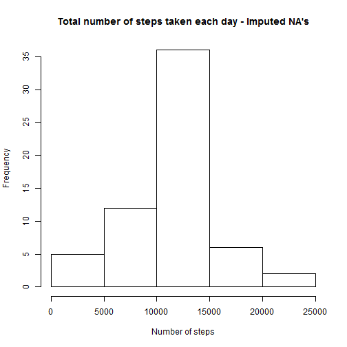

# Reproducible Research: Peer Assessment 1
==========================================

## Loading and preprocessing the data

```r
## Load and preprocess the data
myData = read.csv("activity.csv", header = T, stringsAsFactors = F)
# convert the date
myData$date <- as.Date(myData$date, "%Y-%m-%d")
```


## What is mean total number of steps taken per day?

```r
# Aggregate by date
dailyTotals <- aggregate(steps ~ date, myData, sum)
# Histogram
hist(dailyTotals$steps, main = "Total number of steps taken each day", xlab = "Number of steps")
```

 

```r
# Mean & median
meanSteps <- mean(dailyTotals$steps)
medianSteps <- median(dailyTotals$steps)
```

- Mean = 1.0766 &times; 10<sup>4</sup>
- Median = 10765

## What is the average daily activity pattern?

```r
# Aggregate by interval
intervalMeans <- aggregate(steps ~ interval, myData, mean)
# Time series plot
plot(intervalMeans$interval, intervalMeans$steps, type = "l", xlab = "5-minute interval", 
    ylab = "Average number steps")
```

 

```r
# Interval with max steps
indx <- which.max(intervalMeans$steps)
maxInterval <- intervalMeans[indx, ]$interval
maxSteps <- intervalMeans[indx, ]$steps
```

- Maximum interval 835 with 206.1698 steps 

## Imputing missing values

```r
# Total missing values
totalMissing <- sum(is.na(myData$steps))
```

- Total missing values 2304

```r
# Fill in missing values
missing <- which(is.na(myData$steps))
means <- sapply(myData[missing, "interval"], function(x) {
    intervalMeans[intervalMeans$interval == x, "steps"]
})
myData[missing, "steps"] <- means
# Histrogram
dailyTotals <- aggregate(steps ~ date, myData, sum)
hist(dailyTotals$steps, main = "Total number of steps taken each day - Imputed NA's", 
    xlab = "Number of steps")
```

 

```r
# Mean & median
naMeanSteps <- mean(dailyTotals$steps)
naMedianSteps <- median(dailyTotals$steps)
```

- Mean = 1.0766 &times; 10<sup>4</sup>
- Median = 1.0766 &times; 10<sup>4</sup>  
These values do not differ much from the dataset with missing values included 
so they have very little effect.


## Are there differences in activity patterns between weekdays and weekends?

```r
# Weekday or weekend factor
myData$week <- weekdays(myData$date)
myData$week <- sapply(myData$week, function(x) {
    if (x == "Sunday" | x == "Saturday") {
        "weekend"
    } else {
        "weekday"
    }
})
myData$week <- factor(myData$week)
# Aggregate by interval for each: weekday & weekend
intervalMeans = aggregate(steps ~ interval + week, myData, mean)
# Time series plot
library(lattice)
xyplot(steps ~ interval | week, intervalMeans, type = "l", layout = c(1, 2), 
    xlab = "5-minute Interval", ylab = "Averag number of steps taken")
```

 


